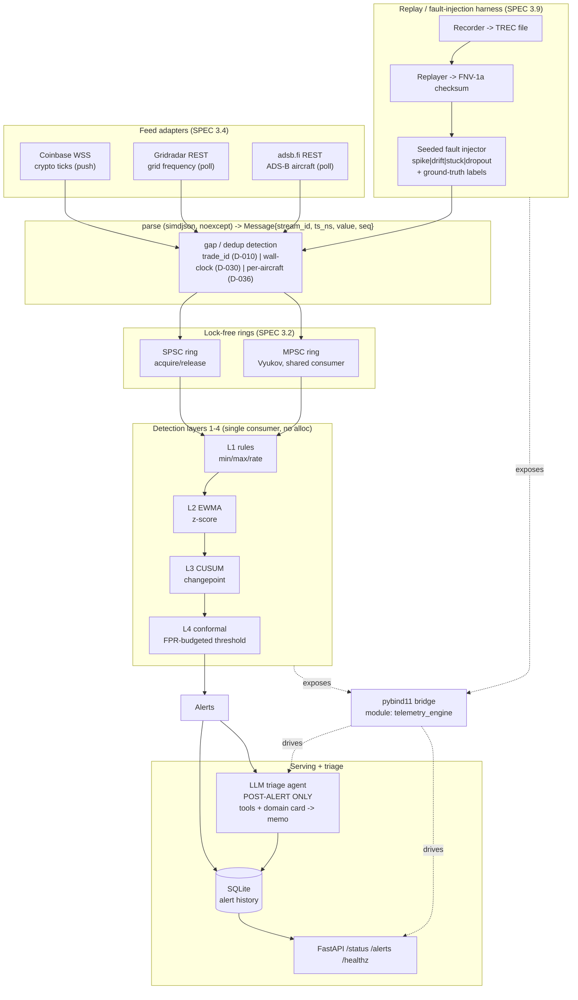

# Real-Time Telemetry Anomaly Engine

## What this is

A domain-agnostic engine that ingests high-rate telemetry streams and raises
calibrated anomaly alerts with bounded detection latency. The core knows only
"streams of timestamped numeric values with schemas"; each domain is a thin
adapter (a feed parser + a YAML config + a domain card), never a fork of the
core. Three adapters ship to prove the core is generic: crypto ticks (Coinbase
WebSocket), grid frequency (Gridradar/Fingrid REST), and ADS-B aircraft
(adsb.fi REST).

**Live since July 2026.** The Coinbase adapter runs 24/7 on a small VPS behind
a bounded-backoff reconnecting daemon; `GET /health` reports uptime, total
messages processed, and last-message timestamp.

The hot path is C++20: a lock-free SPSC/MPSC ring buffer, a fixed-size pool
allocator with no heap allocation after warmup, and four stacked detection
layers (hard-bound rules -> online EWMA z-score -> CUSUM changepoint ->
conformal thresholds that hold a target false-alarm budget). Around it sits a
Python layer: a research half (a BOCPD prototype compared against the C++
CUSUM), a FastAPI status page backed by SQLite, and a post-alert LLM triage
agent that investigates confirmed alerts with tools and writes a structured
incident memo. A pybind11 module (`telemetry_engine`) bridges the two so Python
drives the real C++ detectors rather than reimplementing their math.

It was built as a recruiting-portfolio artifact, so it is meant to be
interrogated: correctness, measured performance, and honesty about what is and
is not verified matter more than feature count. Every module was produced with
a test-driven, multi-agent workflow in which the tests were authored by a
different agent than the implementation, from `SPEC.md`, before the code
existed; a third agent reviewed each phase in a fresh context. When a pinned
test and the pinned algorithm collided, the test was left failing and resolved
by re-derivation rather than quietly weakened (see D-041). Every number in this
README is traceable to `VERIFICATION.md`, and each capability there maps to a
command that reproduces it.

## Architecture



The detection layers run on a single consumer thread that drains the ring and
executes L1->L4 in order; the triage agent and API never touch the hot path.
See `docs/architecture.md` for a prose walkthrough of one message's life and the
determinism story.

## Measured results

All numbers below are lifted from `VERIFICATION.md`. Benchmarks are from this
dev machine (Apple Silicon, macOS, Release); Long-soak is now accumulating on the live deployment (since 2026-07-09); reconnect-under-real-outage remains needs-live-validation until a real upstream outage occurs.

| Metric | Measured | Notes / caveats |
|---|---|---|
| SPSC throughput | ~34M msgs/sec | two-thread, Apple Silicon, Release (`bench_core`) |
| SPSC push/pop + pool alloc/dealloc latency | p50 ~41 ns, p99 ~42 ns | **timer-floor upper bounds** — dominated by ~40 ns `steady_clock` overhead, stated in bench output (D-008) |
| MPSC 4-producer push latency | p50 ~583 ns, p99 ~3.8 us, p99.9 ~8.1 us | contended, includes real queueing |
| Detection delay | 12 samples | CUSUM after injected drift onset; seed 12345, drift magnitude 5.0 over 300 samples, alpha=0.01 k=3 h=8; zero pre-onset false alarms |
| False-alarm rate @ alpha=0.01 | 0.01158 (target 0.01) | inside pre-derived binomial band [0.006441, 0.013559]; seed 0xC0FFEE1234, N=50k, W=500 |
| False-alarm rate @ alpha=0.05 | 0.05184 (target 0.05) | inside pre-derived band [0.042203, 0.057797]; bands derived before the implementation existed |

Triage evaluation (SPEC 3.12) — real LLM runs, seed 42, 10 alerts, grid domain.
The stream/fault side is seeded and deterministic; the LLM side is not. Full
auditable tables (raw memos + evidence + judge reasoning) live in
`docs/eval_runs/`.

| Model | Max turns | Accuracy | Mean judge score | Finding |
|---|---|---|---|---|
| haiku | 6 | 0.400 | 0.295 | 3 of 10 hit the turn budget |
| sonnet | 6 | 0.000 | 0.200 (non-diagnostic: judge partially credits honest abstention) | **all 10 hit max-turns** — sonnet investigates longer than 6 turns; the turn budget, not the model, dominated the result |
| sonnet | 12 | 0.400 | 0.290 | 0 max-turns failures; all memos substantive |

Known limits kept visible, not papered over: `false_alarm` cases can never be
scored "correct" by the hypothesis-to-fault mapping (no hypothesis word maps to
it, D-044), and the hypothesis vocabulary (`telemetry_glitch` etc.) makes drift
systematically under-diagnosed — the sonnet/12 table shows several drifts
described correctly in the evidence yet labelled `telemetry_glitch`.

Live ingestion sanity (not on the hot-path benchmark): a 20s real Coinbase WSS
run received 198 messages, pushed 157 ticks (BTC 86 / ETH 71), 0 parse
failures, 0 gaps (this machine/network; long-soak + reconnect-under-real-outage
is `needs-live-validation`). The ADS-B adapter is verified against a real
recorded feed (60 adsb.fi polls, 26 aircraft, Heathrow area).

## What's honest / unverified

- **Grid live feed** is verified against a **synthetic** format-faithful
  fixture only; Gridradar/Fingrid require a registered API key not available in
  this environment (`needs-live-validation`).
- **Latency histograms on `/status`** are **not implemented, not faked**: the
  C++ hot path does not yet export per-message latency through the bindings, so
  `GET /status` deliberately has no `latency` key and tests assert its absence
  (D-040).
- **Zero heap allocation on the hot path** is **test-verified** by a global
  operator new/delete counting audit (`ctest --test-dir build -R
  HotPathAllocation`): 0 steady-state allocations across parse+ring (450 real
  fixture lines), all four detect layers (10k samples × 2 streams), and 100k
  pool cycles. Caveat: the audit does not intercept C++17 aligned `operator
  new`, and the counting assertion is informational (not failing) under
  sanitizer builds.
- **CI** (`.github/workflows/ci.yml`) is authored but **unverified until
  pushed** — it cannot run in this environment. The YAML is syntactically
  validated (see below); the jobs themselves have not executed.
- **Gap detection on a real feed drop** is `needs-live-validation`; synthetic
  gaps are covered by `tests/feed/test_gap_detection.cpp`.
- Uncontended latency percentiles (~41 ns) are **timer-floor upper bounds**,
  not true op cost. All benchmarks are **this-machine-only**.

## Build & run

Exact commands, reproduced from `VERIFICATION.md`. Everything runs from the repo
root. FetchContent pulls googletest, simdjson (and pybind11 / IXWebSocket when
enabled); no system packages beyond a C++20 compiler, CMake, and Ninja.

### C++ engine (Release + tests)

```sh
cmake -B build -G Ninja && cmake --build build
ctest --test-dir build --output-on-failure                 # 180/180
ctest --test-dir build -R ReplayDeterminism --output-on-failure
./build/benchmarks/bench_core                              # throughput + latency
```

### Sanitizer trees

ASan/TSan runtimes from Apple Clang 14 are broken on this macOS, so the
sanitizer trees use Homebrew LLVM `clang++` (D-007). On Linux/CI, system clang
works directly.

```sh
# ASan + UBSan
cmake -B build-asan -G Ninja -DCMAKE_BUILD_TYPE=Debug -DSANITIZE=address,undefined \
  -DCMAKE_CXX_COMPILER=/opt/homebrew/opt/llvm/bin/clang++
cmake --build build-asan && ctest --test-dir build-asan --output-on-failure

# TSan
cmake -B build-tsan -G Ninja -DCMAKE_BUILD_TYPE=Debug -DSANITIZE=thread \
  -DCMAKE_CXX_COMPILER=/opt/homebrew/opt/llvm/bin/clang++
cmake --build build-tsan && ctest --test-dir build-tsan --output-on-failure
```

### Python (bindings, tests, research, API, agent)

The pybind11 module is OFF by default. Build it against the venv interpreter and
copy the `.so` into site-packages (D-038; no `pip install`, no global
pollution):

```sh
python/.venv/bin/pip install -r python/requirements.txt
cmake -B build -G Ninja -DBUILD_PYTHON_BINDINGS=ON \
  -DPython3_EXECUTABLE=$PWD/python/.venv/bin/python
cmake --build build --target telemetry_engine
cp build/src/bindings/telemetry_engine.cpython-*.so \
  python/.venv/lib/python3.14/site-packages/

python/.venv/bin/python -m pytest python/ -q                 # 69/69

# Research: BOCPD prototype + CUSUM comparison
python/.venv/bin/python -m pytest python/research/test_bocpd.py -q
python/.venv/bin/python python/research/compare_cusum.py

# Triage evaluation against injected ground truth (needs a local `claude` CLI)
PATH="/usr/local/bin:$PATH" python/.venv/bin/python python/agent/run_eval.py \
  --seed 42 --model haiku --max-cases 10 --max-turns 6
```

### FastAPI status page

The app is hosted **in-process** (D-039): there is no separate C++ daemon, and
no committed ASGI entrypoint, because `create_app` needs a primed
`EngineRunner`. Wire one up and serve it (uvicorn's own socket is the "local
socket" of SPEC 3.11):

```python
# serve.py
import uvicorn
from python.api.engine import EngineRunner
from python.api.app import create_app
import telemetry_engine as te

runner = EngineRunner(replay_path="stream.trec", rule_configs=[...],
                      ewma_alpha=0.1, cusum_alpha=0.01, cusum_k=3.0, cusum_h=8.0,
                      conformal_window=500, conformal_alpha=0.01, db_path="alerts.db")
runner.run()
app = create_app(runner)   # GET /status /alerts /healthz

# uvicorn serve:app --port 8000
```

### Live Coinbase smoke tool (optional)

```sh
cmake -B build -G Ninja -DBUILD_LIVE_SMOKE=ON && cmake --build build
./build/src/feed/coinbase_live_smoke --seconds 20
```

## Repo layout

```
include/            header-only C++20 (hot path is templates + fixed structures)
  core/             message, ring_buffer (SPSC/MPSC), pool_allocator
  feed/             handler + coinbase / gridradar / adsb adapters
  detect/           rules, baseline (EWMA), cusum, conformal
  replay/           record_format (TREC), recorder, replayer, checksum, fault_injector
src/
  bindings/         pybind11 module telemetry_engine (BUILD_PYTHON_BINDINGS)
  feed/             coinbase_live_main.cpp (BUILD_LIVE_SMOKE, IXWebSocket)
tests/              180 gtest cases (core / feed / detect / replay / allocation audit) + fixtures
benchmarks/         bench_core.cpp (hand-rolled percentiles, D-008)
python/
  research/         bocpd.py, compare_cusum.py (BOCPD vs CUSUM)
  api/              engine.py (in-process pipeline) + app.py (FastAPI) + SQLite
  agent/            tools.py, triage.py, evaluate.py, run_eval.py (post-alert triage)
  tests/            binding tests
config/             per-domain YAML (crypto_ticks, grid_eu_freq, adsb_alt_baro)
docs/
  feeds/            researched feed API references
  domain_cards/     per-domain knowledge the triage agent reads
  eval_runs/        raw auditable triage evaluation tables
  architecture.md   diagram + message-life walkthrough + determinism story
.github/workflows/  ci.yml (release / ASan+UBSan / TSan / python)
SPEC.md  PLAN.md  DECISIONS.md  VERIFICATION.md
```

## Design decisions

Every non-obvious choice is logged with a one-line rationale in `DECISIONS.md`
(40+ entries). A few worth reading first:

- **D-010** — Coinbase `trade_id`, not `sequence`, is the contiguous per-product
  counter. Ticker is a subset of the product's full sequence space (fixture
  deltas 2..2541), so `sequence`-based gap detection would false-fire on every
  message; `trade_id` increments by exactly 1 per ticker per product.
- **D-002** — the SPSC ring uses unbounded masked head/tail counters so it can
  hold N items at capacity N (fullness is `tail - head >= Capacity`), instead of
  wasting a slot as the classic mod-N ring does.
- **D-041** — TDD held under pressure: a binding test asserted a CUSUM fire the
  pinned algorithm cannot produce. The implementer refused to weaken it; the
  test author independently re-derived the recursion, confirmed the fire never
  happens, and replaced the test with known-answer cases mirroring the C++ suite.
- **D-007** — sanitizer trees use Homebrew LLVM clang++ because Apple Clang 14's
  ASan/TSan runtime aborts at startup on this macOS.
- **D-040** — `/status` omits latency histograms rather than fabricating them.

## Test counts

- **C++**: 180 gtest cases, green in all three trees — Release, ASan+UBSan, and
  TSan (lock-free rings exercised under concurrency).
- **Python**: 69 tests (bindings + API end-to-end + triage agent, all LLM calls
  mocked and deterministic) + 4 BOCPD research tests.

See `VERIFICATION.md` for the per-capability command that reproduces each claim,
and its verified / unverified / needs-live-validation status.
