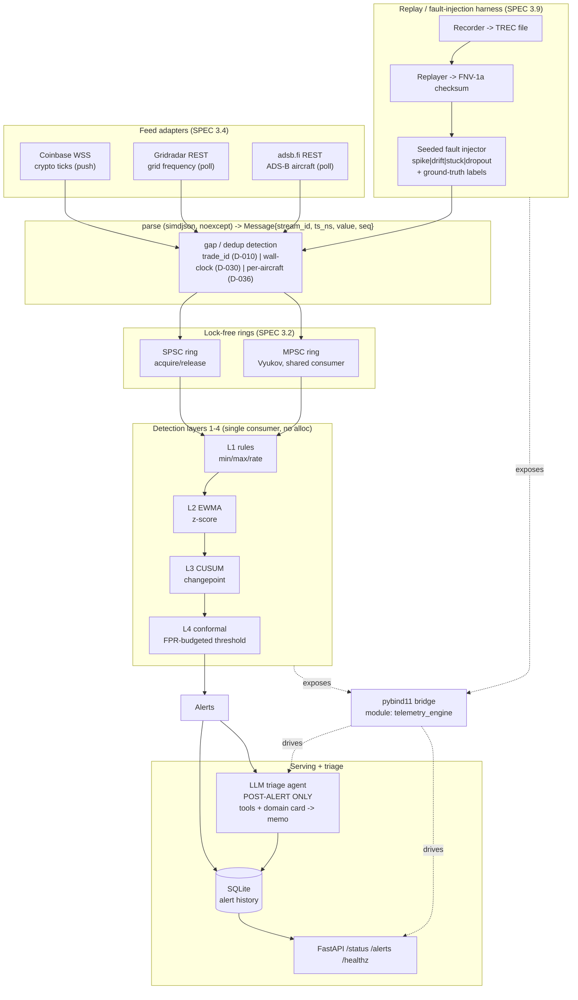

# Architecture

## Diagram

## The life of one message

Take a single BTC-USD ticker frame arriving on the Coinbase WebSocket.

1. **Ingress + parse.** `CoinbaseTickerHandler` owns one reused
   `simdjson::dom::parser` and classifies the frame via the error-code API
   (never the throwing operator API), so `parse()` is genuinely `noexcept` and
   allocation-free after the parser buffer warms (D-012). Price and size are
   JSON *strings*, converted with `strtod` on a 64-byte stack buffer; the
   RFC3339 `time` is turned into epoch-nanoseconds by fixed-field digit scanning
   plus Howard Hinnant's `days_from_civil`, with no `std::get_time` and no heap
   (D-013). The result is a normalized, cache-line-aligned
   `Message{stream_id, ts_ns, value, seq}` where `seq` is the product's
   `trade_id` — the only field that increments by exactly 1 per ticker per
   product (D-010).

2. **Gap check + enqueue.** The handler compares `seq` against the per-stream
   expected counter (an `unordered_map` that inserts once per stream at warmup,
   then does allocation-free lookups, D-011). Contiguous messages advance the
   counter; a gap fires `on_gap(from, to)`. The message is then `try_push`ed onto
   the ring buffer. In the single-feed path that is the SPSC ring, publishing
   the slot with a release store that the consumer's acquire load
   synchronizes-with (D-003); when several feeds share one consumer, the Vyukov
   MPSC ring claims a slot via a relaxed CAS and publishes through a per-slot
   sequence (D-004).

3. **Detect (single consumer, layers in order).** One consumer thread drains the
   ring and runs L1->L4 with no heap allocation. **L1 rules** checks hard bounds
   and rate-of-change from the domain YAML. **L2 EWMA** updates an O(1) running
   mean/variance and yields a z-score. **L3 CUSUM** standardizes the residual
   against its own pre-update running variance and accumulates two-sided sums,
   firing a changepoint when either crosses `h` and resetting after fire
   (D-023/D-024). **L4 conformal** sets the alert threshold from the
   `(1-alpha)` empirical quantile of a recent nonconformity window, sorting into
   a preallocated mutable scratch buffer so the const query allocates nothing
   (D-026). A crossing here is a calibrated alert.

4. **Persist + serve.** The alert is written to SQLite (`stream_id, ts_ns,
   layer, detail, created_at`). `EngineRunner` hosts this whole pipeline
   in-process through the pybind11 bindings — there is no separate C++ daemon
   (D-039) — and the FastAPI app serves it at `GET /status`, `GET /alerts`, and
   `GET /healthz`. `/status` reports uptime, messages processed, throughput, and
   active streams, but deliberately carries **no** `latency` key: the hot path
   does not export per-message latency yet, and this layer does not fabricate it
   (D-040).

5. **Post-alert triage.** Only after a confirmed alert — never on the hot path —
   the LLM triage agent wakes up. Its domain card (e.g. `grid_frequency.md`) is
   folded into the system prompt once; it then runs a hand-rolled JSON tool loop
   (D-043) calling `get_window`, `get_baseline`, `get_concurrent_alerts`, and
   `get_domain_card` to gather evidence, and emits a structured memo
   `{stream, hypothesis, confidence, evidence}`. Malformed output gets one retry
   then a `no_conclusion` memo; the memo is later scored against injected
   ground truth by label matching plus an offline LLM-as-judge (D-044).

## Determinism

Determinism is a hard requirement (SPEC objective #5), and three pieces enforce
it. First, the **TREC record format**: an 8-byte header (`"TREC"` + version) then
fixed 64-byte little-endian records serialized field-by-field via `std::bit_cast`
rather than a raw struct `memcpy`, so output bytes are identical regardless of
in-memory alignment padding, and truncation is detectable by simple size
arithmetic (D-016). Second, the **FNV-1a-64 end-state checksum** folds exactly
the 28 content bytes per message (`stream_id || ts_ns || value || seq`, padding
explicitly excluded, D-017), giving a single digest that must match on replay;
the `replay_determinism` ctest replays a recorded stream twice — including under
a `volatile` busy-loop that simulates uneven caller pacing — and asserts an
identical digest. Third, **seeded fault injection**: onsets are drawn from a
hand-rolled SplitMix64 engine reduced by modulo, never `std::` distributions
(which are implementation-defined), so the same seed plus the same input yields
byte-identical faulted output and matching pipe-delimited ground-truth labels
across stdlibs (D-018/D-019). Together these make a recorded stream reproduce an
identical checksummed end-state, which is what the CI determinism job pins.
